# Week 4: Analytics Engineering (Taxi Rides NY)
### Data Engineering Zoomcamp - dbt, BigQuery, and Medallion Architecture

## 📝 Project Overview
This week focuses on the **Transformation** layer of the ELT pipeline. Using **dbt (data build tool)**, I transformed raw taxi trip data into clean, production-ready analytical models. The project demonstrates a modular approach to data modeling, using **Staging**, **Intermediate**, and **Core** layers to build a scalable data warehouse.

---

## 🏗️Architecture & Data Models
The transformation process follows a structured **Medallion Architecture**.

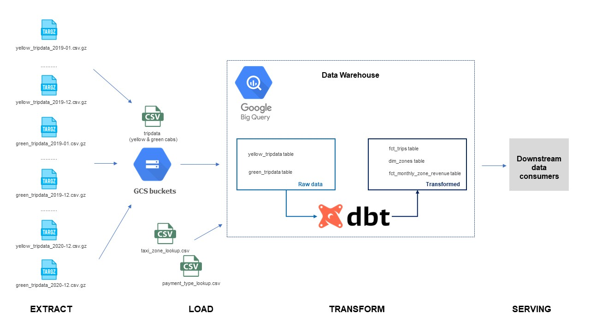

## 🛠️ Technologies & Infrastructure
* **Cloud:** Data Lake for raw file storage (Google Cloud Storage, GCS), Data Warehouse (Google BigQuery)
* **dbt (Cloud/Core):** Transformation, modular modeling, and testing
* **Language:** Python (Ingestion), SQL (Transformations)
* **Data Visualization:** Power BI (Desktop & Service)
* **Source:** [NYC TLC Trip Record Data](https://www.nyc.gov/site/tlc/about/tlc-trip-record-data.page)

---
## 🏗️ Data Pipeline Stages

### 1. Staging Layer (`staging/`)
Raw data is cleaned, fields are renamed for consistency, and data types are cast.

* `stg_green_tripdata.sql`: Cleaning Green taxi records.
* `stg_yellow_tripdata.sql`: Cleaning Yellow taxi records.
* `stg_fhv_tripdata.sql`: Cleaning FHV (For-Hire Vehicle) records.

### 2. Seeds (`seeds/`)
Static lookup tables loaded directly into BigQuery:

* `taxi_zone_lookup.csv`: Mapping location IDs to Boroughs and Zones.
* `payment_type_lookup.csv`: Mapping payment codes to descriptions.

### 3. Intermediate Layer (`intermediate/`)
Reusable logic and data joining before reaching the final fact tables.

* `int_trips_unioned.sql`: Unioning Green and Yellow taxi data into a single stream.
* `int_trips.sql`: Applying common business logic and joining with seeds.

### 4. Core Layer (`core/`)
Final analytical models optimized for querying and reporting.

* `dim_zones.sql`: Dimensional table for taxi zones..
* `fct_trips.sql`: The main fact table containing all processed trip records.
* `fct_monthly_zone_revenue.sql`: Aggregated reporting table for financial analysis.

---

## 📊 Serving: Power BI Dashboards

**Data Modeling & DAX**
The final data is served through two specialized dashboards in **Power BI**.
* **Star Schema:** `fct_monthly_zone_revenue` linked to `Calendar` table with built-in logic to filter out future-dated anomalies (e.g., Year 2090).
* **Key Measures:** 
    * **Total Revenue & Total Tips**: Core financial aggregations used to track gross volume and gratuity trends across different service types.
    * **Avg Ticket**: A key performance indicator (KPI) calculating the average fare per trip to monitor unit economics.
    * **Avg Distance**: Used in combination with financial metrics to analyze the relationship between trip length and profitability.
    * **Avg Tip Percentage**: A sophisticated DAX measure (`DIVIDE` of Tips by Fare) used to evaluate service quality and passenger tipping behavior by zone.
    * **Max Revenue Point**: An advanced visualization technique using `MAXX` and `ALLSELECTED` to dynamically highlight historical records on trend charts.

**Creating Calendar calculated table:**
```dax
Calendar = 
-- Find the minimum and maximum date in your data
VAR MinDate = MIN('fct_monthly_zone_revenue'[revenue_month])
-- We limit the calendar to today, so as not to go into 2090
VAR MaxDate = IF(
    MAX('fct_monthly_zone_revenue'[revenue_month]) > TODAY(), 
    TODAY(), 
    MAX('fct_monthly_zone_revenue'[revenue_month])
)
-- Creating a basic list of dates
VAR BaseCalendar = CALENDAR(MinDate, MaxDate)

RETURN
    ADDCOLUMNS (
        BaseCalendar,
        "Year", YEAR ( [Date] ),
        "Month Number", MONTH ( [Date] ),
        "Month Name", FORMAT ( [Date], "MMMM" ),
        "Month Short", FORMAT ( [Date], "MMM" ),
        "Year Month Key", FORMAT ( [Date], "YYYY-MM" ),
        "Year Month", FORMAT ( [Date], "MMM YYYY" ),
        "Quarter", "Q" & FORMAT ( [Date], "Q" )
    )
```

**Creating a data model and relationships in Model View:**

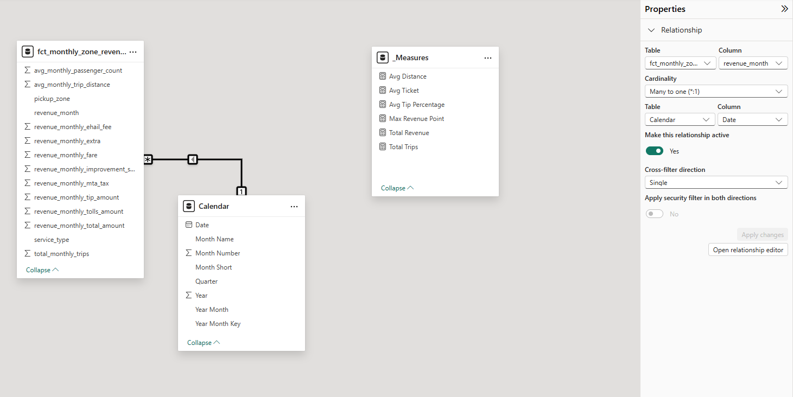


**1st dashboard:**
* **KPIs**: Total Revenue, Total Trips, Avg Ticket, Avg Tip Percentage.
* **Visuals**: To 10 Revenue Generating Zones, Bottom 10 Zones by Revenue, Service Type Market Share by Trips, Revenue Dynamics by Service Type, Monthly Revenue Trend.
* **Insight**:
  * **Geographic Revenue Concentration**: The comparison between Top 10 and Bottom 10 zones identifies key revenue hubs (e.g., airports and Manhattan) versus underperforming areas. This highlights where the fleet is most productive and where market presence is inefficient.
  * **Market Share & Fleet Utilization**: The Service Type breakdown reveals the dominance of Yellow vs. Green taxis, allowing for strategic decisions on fleet expansion or reduction based on actual trip volume.
  * **Growth & Recovery Trends**: The Monthly Revenue Trend with the Max Revenue Point marker allows stakeholders to instantly compare current performance against historical records, identifying seasonal recovery patterns or the impact of external market shifts.


**Dashbord #1**

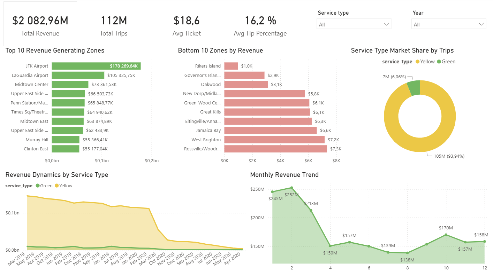


**2nd dashboard:**
* **Visuals**: Zone Efficiency: Average Fare vs. Trip Distance, Top 20 Pickup Zones by Total Trips.
* **Insight**:
  * **High-Yield Zone Identification**: The Scatter Chart isolates "outlier" zones with high average fares but low travel distances—representing the most profitable areas for drivers.
  * **Operational Efficiency Gap**: The trend line visually separates high-margin zones (above the line) from low-margin zones (below the line), pinpointing areas where travel time and distance are not being adequately compensated by current fare structures.
  * **Service Quality Correlation**: By mapping Avg Tip Percentage across zones, the dashboard identifies correlations between passenger demographics, trip costs, and tipping behavior, providing a proxy for customer satisfaction and service value.

**Dashbord #2**
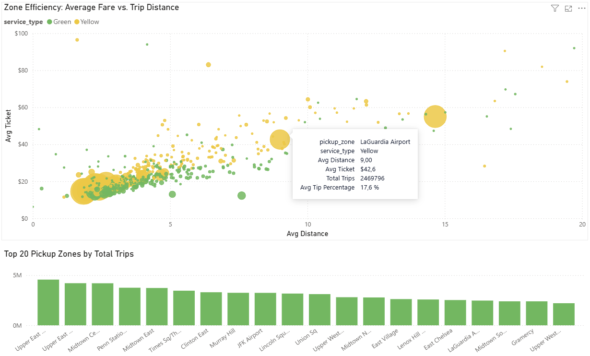

---

## 🚀 How to Run

**Step 1: Google Cloud Platform Setup**
1. **Create a Project:**  Create a new project (e.g., `kestra-sandbox-486404`). 

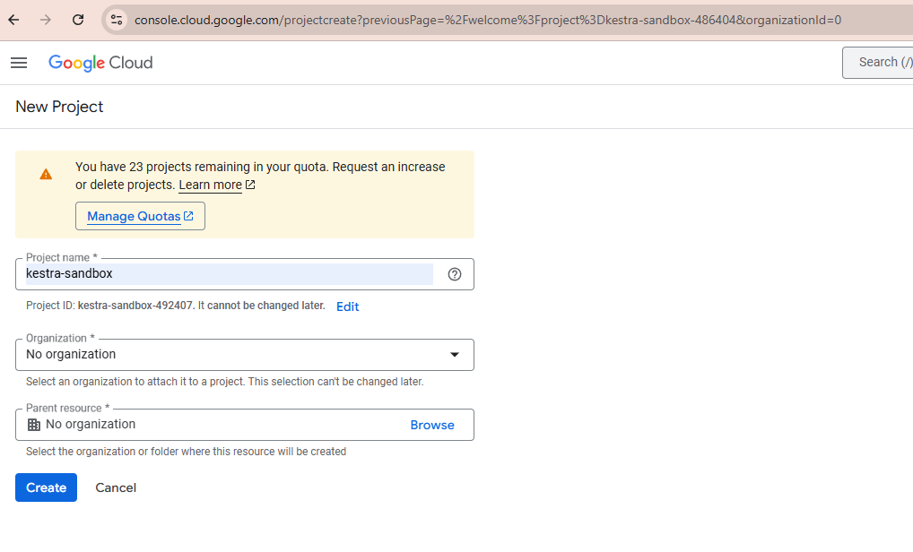

2. **Google Cloud Storage (GCS):** Create a bucket (e.g., `kestra-zoomcamp-adil-demo`).

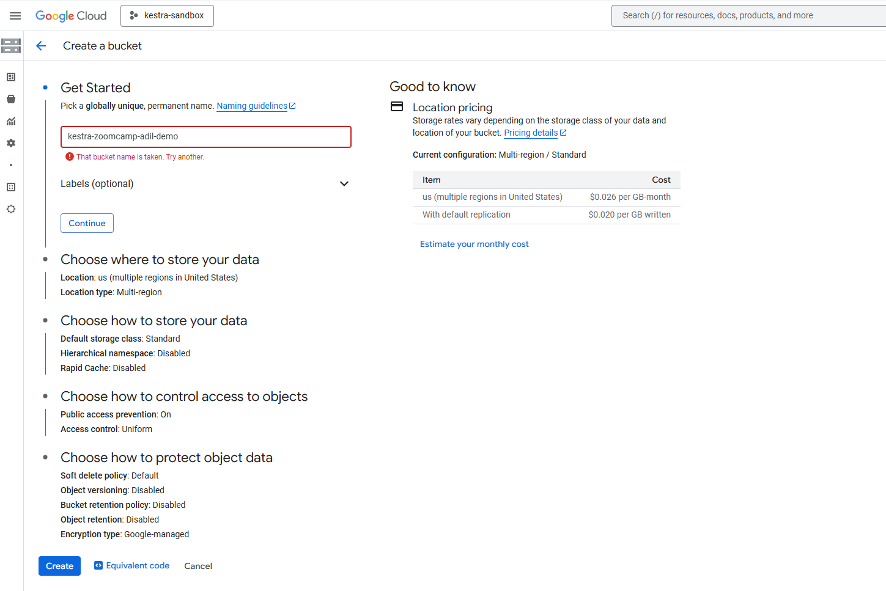

3. Service Account:

* Create a Service Account with **Storage Admin** and **BigQuery Admin** roles.
* Generate a JSON key, rename it to `gcs.json`, and place it in the project root directory.
* Create a `.gitignore` file in the project root (if it doesn’t exist) and add the following line:
`gcs.json`
This ensures that your service account key is excluded from version control and not uploaded to GitHub.

**Step 2: Data Ingestion (Upload to GCS)**

Run the Python scripts to upload static datasets (2019-2020 Green/Yellow, 2019 FHV) from the DTC repository to your **GCS bucket**:

```bash

python load_green_taxi_data.py
python load_yellow_taxi_data.py
python load_fhv_taxi_data.py

```
**Raw data uploaded to GCS Bucket:**

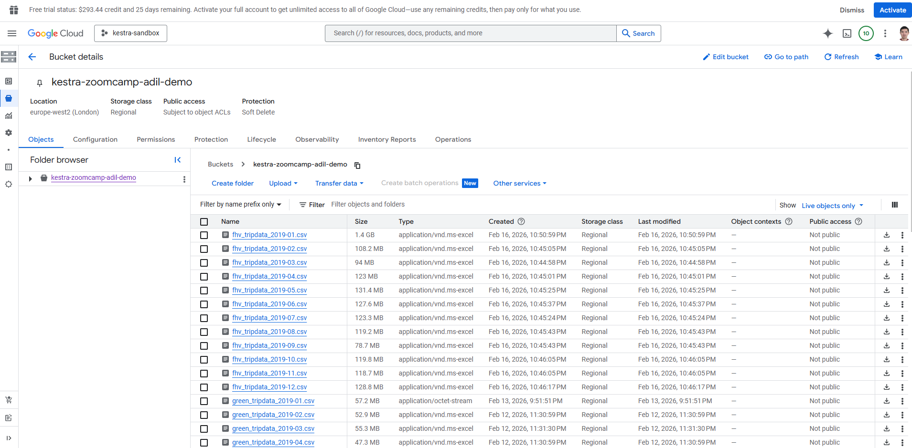


**Step 3: Create BigQuery Tables**

1. **External Tables**: Before running the transformation pipeline in dbt, you must link the GCS files to BigQuery. Execute the following SQL commands in the **BigQuery Console** to create **Bronze Layer**. This allows BigQuery to query data directly from GCS without double storage:

```sql
-- External Table for Green tripdata
CREATE OR REPLACE EXTERNAL TABLE `kestra-sandbox-486404.zoomcamp.green_tripdata_ext`
(
  VendorID STRING,
  lpep_pickup_datetime TIMESTAMP,
  lpep_dropoff_datetime TIMESTAMP,
  store_and_fwd_flag STRING,
  RatecodeID STRING,
  PULocationID STRING,
  DOLocationID STRING,
  passenger_count INT64,
  trip_distance NUMERIC,
  fare_amount NUMERIC,
  extra NUMERIC,
  mta_tax NUMERIC,
  tip_amount NUMERIC,
  tolls_amount NUMERIC,
  ehail_fee NUMERIC,
  improvement_surcharge NUMERIC,
  total_amount NUMERIC,
  payment_type INTEGER,
  trip_type STRING,
  congestion_surcharge NUMERIC
)
OPTIONS (
  format = 'CSV',
  uris = [
        'gs://kestra-zoomcamp-adil-demo/green_tripdata_2019-*.csv',
        'gs://kestra-zoomcamp-adil-demo/green_tripdata_2020-*.csv'],
  skip_leading_rows = 1,
  ignore_unknown_values = TRUE
);

-- External Table for Yellow tripdata
CREATE OR REPLACE EXTERNAL TABLE `kestra-sandbox-486404.zoomcamp.yellow_tripdata_ext`
(
  VendorID STRING,
  tpep_pickup_datetime TIMESTAMP,
  tpep_dropoff_datetime TIMESTAMP,
  passenger_count INT64,
  trip_distance NUMERIC,
  RatecodeID STRING,
  store_and_fwd_flag STRING,
  PULocationID STRING,
  DOLocationID STRING,
  payment_type INTEGER,
  fare_amount NUMERIC,
  extra NUMERIC,
  mta_tax NUMERIC,
  tip_amount NUMERIC,
  tolls_amount NUMERIC,
  improvement_surcharge NUMERIC,
  total_amount NUMERIC,
  congestion_surcharge NUMERIC
)
OPTIONS (
  format = 'CSV',
  uris = [
        'gs://kestra-zoomcamp-adil-demo/yellow_tripdata_2019-*.csv',
        'gs://kestra-zoomcamp-adil-demo/yellow_tripdata_2020-*.csv'
        ],
  skip_leading_rows = 1,
  ignore_unknown_values = TRUE
);

-- External Table for FHV (For-Hire Vehicle) tripdata
CREATE OR REPLACE EXTERNAL TABLE `kestra-sandbox-486404.zoomcamp.fhv_tripdata_2019_ext`
(
  distpatching_base_num STRING,
  pickup_datetime TIMESTAMP,
  dropoff_datetime TIMESTAMP,
  PULocationID INTEGER,
  DOLocationID INTEGER,
  SR_Flag STRING,
  Affiliated_base_number STRING
)
OPTIONS (
  format = 'CSV',
  uris = ['gs://kestra-zoomcamp-adil-demo/fhv_tripdata_2019-*.csv'],
  skip_leading_rows = 1,
  ignore_unknown_values = TRUE
);
```
**Example of BigQuery external table preview**

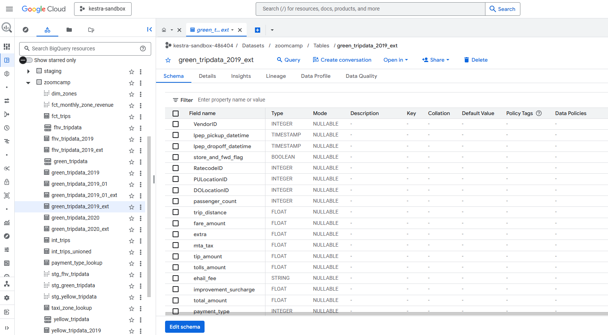

2. **Native Tables (Optional/Performance)**: If you prefer better performance for dbt runs, you can materialize the external tables as native BigQuery tables:

```sql
-- Native Table for Green tripdata
CREATE TABLE IF NOT EXISTS `kestra-sandbox-486404.zoomcamp.green_tripdata`
(
  unique_row_id BYTES OPTIONS (description = 'A unique identifier for the trip, generated by hashing key trip attributes.'),
  filename STRING OPTIONS (description = 'The source filename from which the trip data was loaded.'),
  VendorID STRING OPTIONS (description = 'A code indicating the LPEP provider that provided the record.'),
  lpep_pickup_datetime TIMESTAMP OPTIONS (description = 'The date and time when the meter was engaged'),
  lpep_dropoff_datetime TIMESTAMP OPTIONS (description = 'The date and time when the meter was disengaged'),
  store_and_fwd_flag STRING OPTIONS (description = 'Store and forward flag'),
  RatecodeID STRING OPTIONS (description = 'The final rate code in effect at the end of the trip.'),
  PULocationID STRING OPTIONS (description = 'Pickup Taxi Zone'),
  DOLocationID STRING OPTIONS (description = 'Dropoff Taxi Zone'),
  passenger_count INT64 OPTIONS (description = 'The number of passengers in the vehicle'),
  trip_distance NUMERIC OPTIONS (description = 'Trip distance in miles'),
  fare_amount NUMERIC OPTIONS (description = 'Fare amount'),
  extra NUMERIC OPTIONS (description = 'Extra charges'),
  mta_tax NUMERIC OPTIONS (description = 'MTA tax'),
  tip_amount NUMERIC OPTIONS (description = 'Tip amount'),
  tolls_amount NUMERIC OPTIONS (description = 'Tolls amount'),
  ehail_fee NUMERIC OPTIONS (description = 'E-hail fee'),
  improvement_surcharge NUMERIC OPTIONS (description = 'Improvement surcharge'),
  total_amount NUMERIC OPTIONS (description = 'Total amount'),
  payment_type INT64 OPTIONS (description = 'Payment method code'),
  trip_type STRING OPTIONS (description = 'Trip type (1=street-hail, 2=dispatch)'),
  congestion_surcharge NUMERIC OPTIONS (description = 'Congestion surcharge')
)
PARTITION BY DATE(lpep_pickup_datetime);

-- Native Table for Yellow tripdata
CREATE TABLE IF NOT EXISTS `kestra-sandbox-486404.zoomcamp.yellow_tripdata`
(
  unique_row_id BYTES OPTIONS (description = 'A unique identifier for the trip, generated by hashing key trip attributes.'),
  filename STRING OPTIONS (description = 'The source filename from which the trip data was loaded.'),
  VendorID STRING OPTIONS (description = 'A code indicating the LPEP provider that provided the record.'),
  tpep_pickup_datetime TIMESTAMP OPTIONS (description = 'The date and time when the meter was engaged'),
  tpep_dropoff_datetime TIMESTAMP OPTIONS (description = 'The date and time when the meter was disengaged'),
  passenger_count INT64 OPTIONS (description = 'The number of passengers in the vehicle.'),
  trip_distance NUMERIC OPTIONS (description = 'The elapsed trip distance in miles reported by the taximeter.'),
  RatecodeID STRING OPTIONS (description = 'The final rate code in effect at the end of the trip.'),
  store_and_fwd_flag STRING OPTIONS (description = 'Store and forward flag'),
  PULocationID STRING OPTIONS (description = 'Pickup Taxi Zone'),
  DOLocationID STRING OPTIONS (description = 'Dropoff Taxi Zone'),
  payment_type INT64 OPTIONS (description = 'Payment method code'),
  fare_amount NUMERIC OPTIONS (description = 'Fare amount'),
  extra NUMERIC OPTIONS (description = 'Extra charges'),
  mta_tax NUMERIC OPTIONS (description = 'MTA tax'),
  tip_amount NUMERIC OPTIONS (description = 'Tip amount'),
  tolls_amount NUMERIC OPTIONS (description = 'Tolls amount'),
  improvement_surcharge NUMERIC OPTIONS (description = 'Improvement surcharge'),
  total_amount NUMERIC OPTIONS (description = 'Total amount'),
  congestion_surcharge NUMERIC OPTIONS (description = 'Congestion surcharge')
)
PARTITION BY DATE(tpep_pickup_datetime);

-- Native Table for FHV tripdata
CREATE TABLE IF NOT EXISTS `kestra-sandbox-486404.zoomcamp.fhv_tripdata`
(
  unique_row_id BYTES OPTIONS (description = 'A unique identifier for the trip, generated by hashing key trip attributes.'),
  filename STRING OPTIONS (description = 'The source filename from which the trip data was loaded.'),
  dispatching_base_num STRING OPTIONS (description = 'The TLC Base License Number of the base that dispatched the trip'),
  pickup_datetime TIMESTAMP OPTIONS (description = 'The date and time when the trip started'),
  dropOff_datetime TIMESTAMP OPTIONS (description = 'The date and time when the trip ended'),
  PUlocationID INT64 OPTIONS (description = 'Pickup Taxi Zone'),
  DOlocationID INT64 OPTIONS (description = 'Dropoff Taxi Zone'),
  SR_Flag STRING OPTIONS (description = 'Indicates if the trip was a shared ride'),
  Affiliated_base_number STRING OPTIONS (description = 'The TLC Base License Number of the affiliated base')
)
PARTITION BY DATE(pickup_datetime)
```

**Example of BigQuery native table preview**

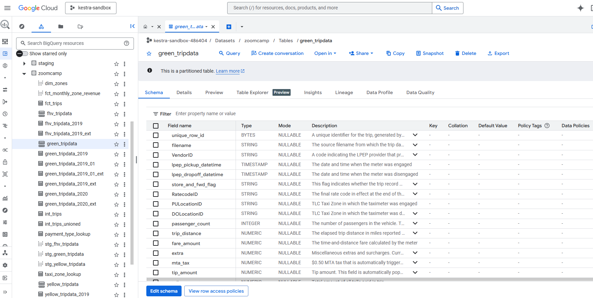

3. Inserting data into native BigQuery tables **green_tripdata**, **yellow_tripdata**, **fhv_tripdata**

```sql
INSERT INTO `kestra-sandbox-486404.zoomcamp.green_tripdata`
SELECT
  TO_HEX(MD5(CONCAT(
    IFNULL(CAST(VendorID AS STRING), ''),
    IFNULL(CAST(lpep_pickup_datetime AS STRING), ''),
    IFNULL(CAST(lpep_dropoff_datetime AS STRING), ''),
    IFNULL(CAST(PULocationID AS STRING), ''),
    IFNULL(CAST(DOLocationID AS STRING), '')
  ))) AS unique_row_id,

  NULL AS filename,

  t.*
FROM `kestra-sandbox-486404.zoomcamp.green_tripdata_ext` t;

INSERT INTO `kestra-sandbox-486404.zoomcamp.yellow_tripdata`
SELECT
  TO_HEX(MD5(CONCAT(
    IFNULL(CAST(VendorID AS STRING), ''),
    IFNULL(CAST(tpep_pickup_datetime AS STRING), ''),
    IFNULL(CAST(tpep_dropoff_datetime AS STRING), ''),
    IFNULL(CAST(PULocationID AS STRING), ''),
    IFNULL(CAST(DOLocationID AS STRING), '')
  ))) AS unique_row_id,

  NULL AS filename,

  t.*
FROM `kestra-sandbox-486404.zoomcamp.yellow_tripdata_ext` t;

INSERT INTO `kestra-sandbox-486404.zoomcamp.fhv_tripdata`
SELECT
  TO_HEX(MD5(CONCAT(
    IFNULL(CAST(dispatching_base_num AS STRING), ''),
    IFNULL(CAST(pickup_datetime AS STRING), ''),
    IFNULL(CAST(dropOff_datetime AS STRING), ''),
    IFNULL(CAST(PUlocationID AS STRING), ''),
    IFNULL(CAST(DOlocationID AS STRING), '')
  ))) AS unique_row_id,

  NULL AS filename,

  t.*
FROM `kestra-sandbox-486404.zoomcamp.fhv_tripdata_ext` t;
```
**Example of BigQuery native table with data**

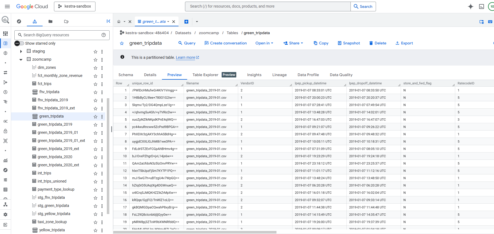

**Step 4: dbt Configuration & Execution**

Now that the external tables are ready, execute the **Bruin** pipeline to perform data cleaning, partitioning, and modeling:

```bash
# 1. Install dbt dependencies
dbt deps

# 2. Load seed files (taxi zones, payment types)
dbt seed

# 3. Build the entire pipeline (Production run)
dbt build --vars 'is_test_run: false'
```

**Data Lineage**

The data flow is transparent and manageable:

**Data Lineage in Staging Model**
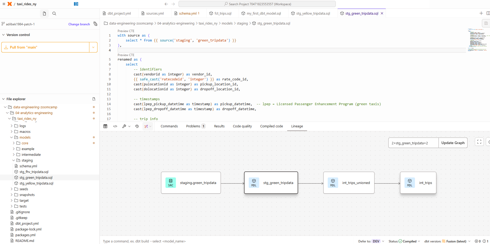

**Data Lineage in Intermediate Model**
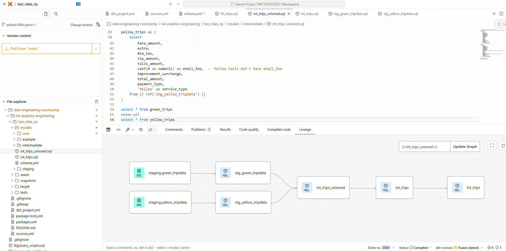

**Data Lineage in Core Model**
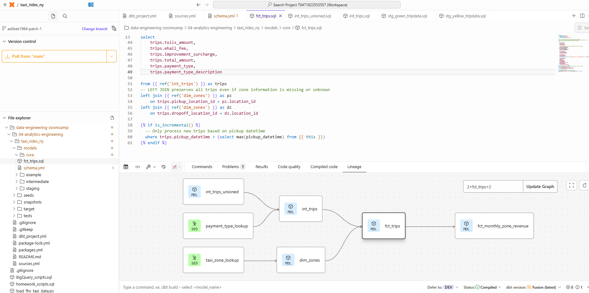

**Step 5: Visualization**

1. Open `US Flights Data 2015 Dashboard.pbix` in Power BI Desktop.
2. Go to **Transform Data -> Data Source Settings**.
3. Change the Project ID to your own (e.g., `kestra-sandbox-486404`), connect to the `zoomcamp` dataset and click Refresh .

**Getting Data from BigQuery Database**
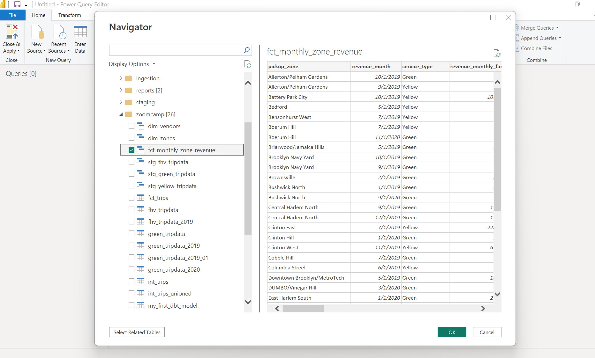

## Homework

### Question 3. Counting Records in `fct_monthly_zone_revenue`
After running your dbt project, query the fct_monthly_zone_revenue model.

What is the count of records in the fct_monthly_zone_revenue model?

* 12,998
* 14,120
* **12,184**
* 15,421

```sql
SELECT
  COUNT(*) AS num_of_records,
FROM `kestra-sandbox-486404.zoomcamp.fct_monthly_zone_revenue`;

--Answer: 12,184
```
### Question 4. Best Performing Zone for Green Taxis (2020)
Using the `fct_monthly_zone_revenue table`, find the pickup zone with the highest total revenue (`revenue_monthly_total_amount`) for Green taxi trips in 2020.

Which zone had the highest revenue?

* **East Harlem North**
* Morningside Heights
* East Harlem South
* Washington Heights South

```sql
SELECT
  MAX(revenue_monthly_total_amount) AS highest_total_revenue,
  pickup_zone
FROM `kestra-sandbox-486404.zoomcamp.fct_monthly_zone_revenue`
WHERE
  service_type = 'Green'
  AND EXTRACT(YEAR FROM revenue_month) = 2020
GROUP BY pickup_zone
ORDER BY highest_total_revenue DESC
LIMIT 1;

--Answer: East Harlem North (434555.26)
```
### Question 5. Green Taxi Trip Counts (October 2019)
Using the `fct_monthly_zone_revenue` table, what is the total number of trips (`total_monthly_trips`) for Green taxis in October 2019?

* 500,234
* 350,891
* **384,624**
* 421,509

```sql
SELECT
  SUM(total_monthly_trips) AS total_monthly_trips,
FROM `kestra-sandbox-486404.zoomcamp.fct_monthly_zone_revenue`
WHERE
  service_type = 'Green'
  AND EXTRACT(YEAR FROM revenue_month) = 2019
  AND EXTRACT(MONTH FROM revenue_month) = 10;

--Answer: Total monthly trips 384,62
```

### Question 6. Build a Staging Model for FHV Data
Create a staging model for the For-Hire Vehicle (FHV) trip data for 2019.

1. Load the FHV trip data for 2019 into your data warehouse
2. Create a staging model `stg_fhv_tripdata` with these requirements:
  - Filter out records where `dispatching_base_num` IS NULL
  - Rename fields to match your project's naming conventions (e.g., `PUlocationID` → `pickup_location_id`)

What is the count of records in `stg_fhv_tripdata`?

* 42,084,899
* **43,244,693**
* 22,998,722
* 44,112,187

```sql
SELECT
  COUNT(*) AS num_of_records
FROM `kestra-sandbox-486404.zoomcamp.stg_fhv_tripdata`;

--Answer: 43,244,693
```
