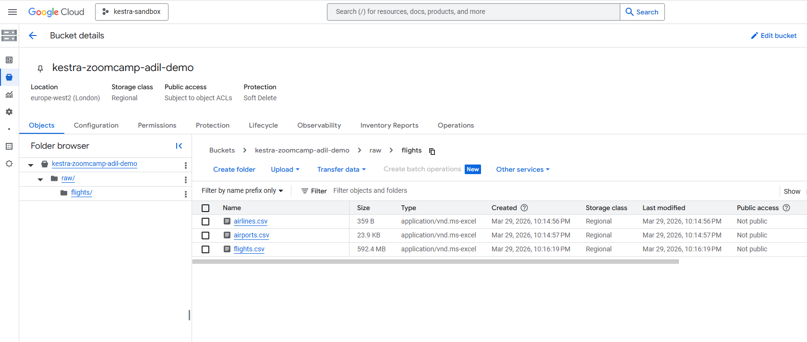
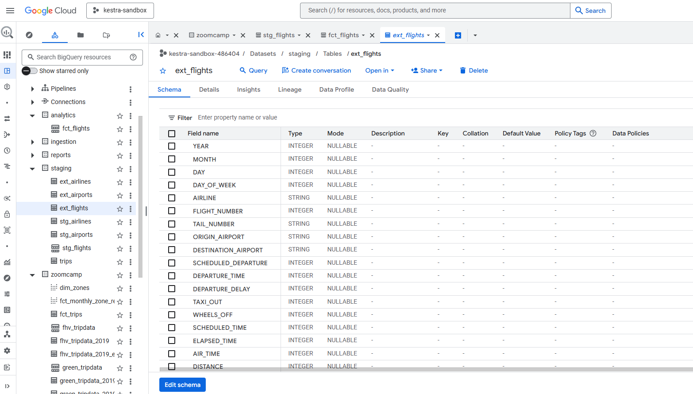
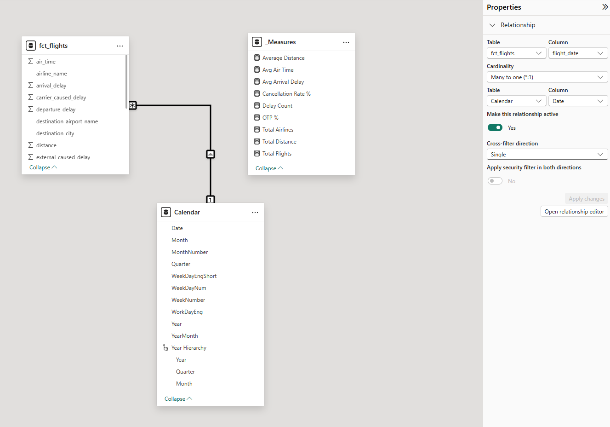
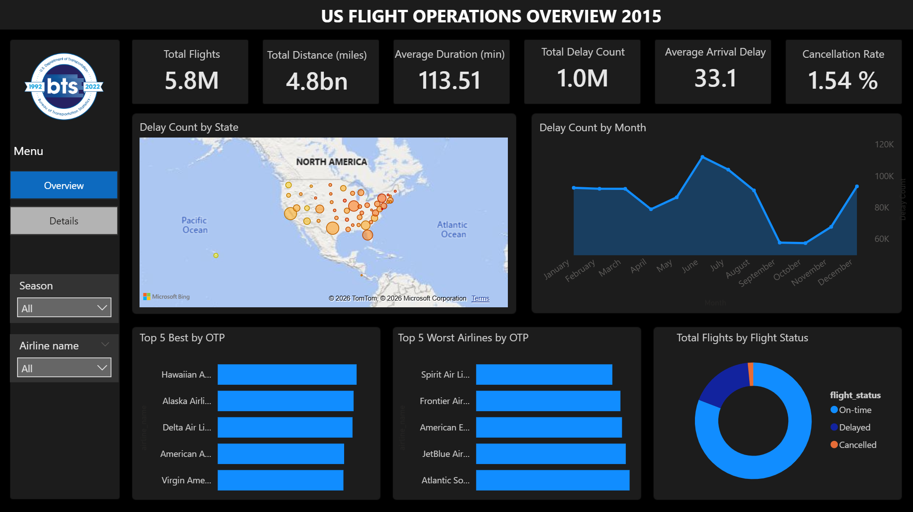
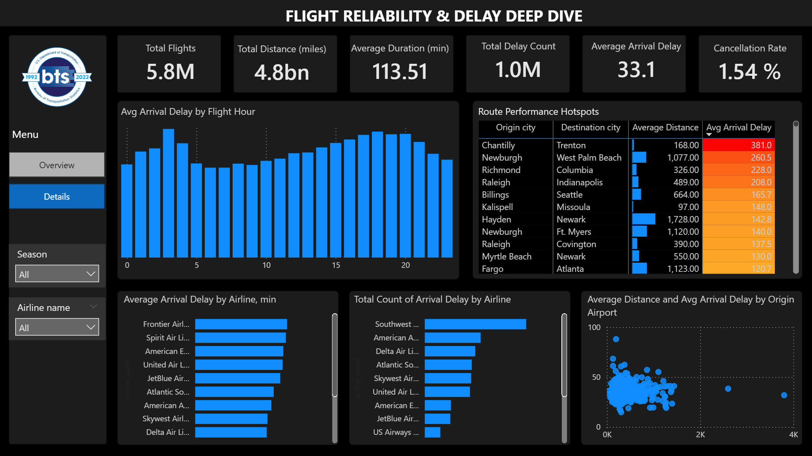

# US Flights Data Engineering Project (2015)
### Data Engineering Project: Medallion Architecture with Python, BigQuery, and Bruin

## 📝 Problem Description
The aviation industry generates massive amounts of data daily. This project analyzes a dataset of **5.8 million flights** in the US from 2015 to identify patterns in delays and cancellations. The goal is to provide actionable insights for operational management through a robust data pipeline and interactive dashboards.

**Key Questions Addressed:**
* **Punctuality:** Which airlines and airports are the most/least punctual (OTP)?
* **Correlation:** How do flight distance and time of day affect the probability of delay?
* **Seasonality:** What are the seasonal trends in flight reliability?

---

## 🏗️ Project Architecture
Since the official DOT Bureau of Transportation Statistics does not provide a public API, the data is sourced from **Kaggle**. The project follows a modern **ELT (Extract, Load, Transform)** approach using the **Medallion Architecture** (Bronze, Silver, Gold layers), moving data from raw CSVs to structured analytical reports.


## 🛠️ Technologies & Infrastructure
* **Cloud:** Storage (Google Cloud Storage, GCS), Data Warehouse ([Google BigQuery](https://cloud.google.com/bigquery))
* **Infrastructure:** Batch Processing Architecture
* **Workflow Orchestration & Transformation:** [Bruin](https://github.com/bruin-data/bruin)
* **Language:** Python (Ingestion), SQL (Transformations)
* **Data Visualization:** Power BI (Desktop & Service)
* **Source:** [Kaggle: 2015 Flight Delays and Cancellations](https://www.kaggle.com/datasets/usdot/flight-delays)

---

## 🏗️ Data Pipeline Stages

### 1. Data Acquisition & Ingestion (Bronze Layer)
The project utilizes a **Batch** approach. Data is uploaded from local sources to **Google Cloud Storage** as the landing zone.

* **Source:** Manual download of `airlines.csv`, `airports.csv`, and `flights.csv` from Kaggle into `08-course-project/data/flights`.
* **Upload:** The script `upload_flights_data.py` (located in the root) processes these local files and uploads them to a **Google Cloud Storage** bucket.
* **External Access:** BigQuery **External Tables** are defined to reference these CSVs directly from GCS, serving as our **Bronze (Raw)** layer.

```python 
# Fragments of the ingestion logic
BUCKET_NAME = "kestra-zoomcamp-adil-demo"
GCS_BASE_FOLDER = "raw/flights"
...
...
for file_path in csv_files:
        file_name = file_path.name
        # Standardizing name: lower_case and no spaces
        target_blob_name = f"{GCS_BASE_FOLDER}/{file_name.lower().replace(' ', '_')}"
        blob = bucket.blob(target_blob_name)

        print(f"[*] Uploading {file_name}...")
        try:
            # Using upload_from_filename is best for large files like flights.csv
            blob.upload_from_filename(str(file_path))
            print(f"    [OK] Uploaded to gs://{BUCKET_NAME}/{target_blob_name}")
        except Exception as e:
            print(f"    [X] Failed to upload {file_name}: {e}")

    print("\n[V] Ingestion process finished.")
```

**Raw data uploaded to GCS Bucket:**


**External Tables:**
To keep the architecture cost-effective, we use BigQuery External Tables to query data directly from GCS without duplication.

```sql
CREATE OR REPLACE EXTERNAL TABLE `kestra-sandbox-486404.staging.ext_flights`
(
  YEAR INT64,
  MONTH INT64,
  DAY INT64,
  DAY_OF_WEEK INT64,
  AIRLINE STRING,
  FLIGHT_NUMBER INT64,
  ...
  ...
  ...
  LATE_AIRCRAFT_DELAY INT64,
  WEATHER_DELAY INT64
)
OPTIONS (
  format = 'CSV',
  uris = ['gs://kestra-zoomcamp-adil-demo/raw/flights/flights.csv'],
  skip_leading_rows = 1
);
```

**Example of BigQuery external table referencing from GCS**




### 2. Silver Layer (Staging)
* **Tool:** Bruin
* **Process:** Cleaning, renaming to `snake_case`, and schema enforcement for:
    * `stg_airlines`
    * `stg_airports`
    * `stg_flights` (Optimized with **Day Partitioning** and **Clustering** by `airline_id`).

### 3. Gold Layer (Analytics & Reports)
* **Analytical Table:** `fct_flights` — The core fact table. **Optimized using Partitioning (by Month) and Clustering (by Airline)** to comply with BigQuery best practices for large datasets.
* **Reporting:** — Targeted tables for specific dashboards (e.g., `winter_delay_analysis`).

For both of these layers we use **Bruin** to run our T (Transform) in the **ELT process**. The pipeline is idempotent and handles dependency management.

**Pipeline Execution**

```bash

bruin run pipeline/assets/staging/stg_airports.sql

```

```bash

bruin run pipeline/assets/staging/stg_airlines.sql

```

```bash

bruin run pipeline/assets/staging/stg_flights.sql

```
```bash

bruin run pipeline/assets/analytics/fct_flights.sql

```

```bash

bruin run pipeline/assets/reports/winter_delay_analysis.sql

```


**Review Data Lineage**

The data flow is transparent and manageable:


---

## 📊 Serving: Power BI Dashboards

**Data Modeling & DAX**
The final data is served through two specialized dashboards in **Power BI**.
* **Star Schema:** `fct_flights` linked to `Calendar`
* **Key Measures:** Batch Processing Architecture
    * `Avg Arrival Delay`: Calculates average for values `> 0` to ensure accuracy
    * `OTP %`: On-Time Performance (flights with < 15 min delay).

**Creating Calendar calculated table:**
```dax
Calendar = 
VAR MinDate = MIN('fct_flights'[flight_date])
VAR MaxDate = MAX('fct_flights'[flight_date])
RETURN
ADDCOLUMNS(
    CALENDAR(
        DATE(YEAR(MinDate), 1, 1), 
        DATE(YEAR(MaxDate), 12, 31)
    ),
    "Year", YEAR([Date]),
    "MonthNumber", MONTH([Date]),
    "Month", FORMAT([Date], "mmmm"), 
    "YearMonth", FORMAT([Date], "yyyy-mm"),
    "Quarter", "Qtr " & FORMAT([Date], "q"),
    "WeekDayNum", WEEKDAY([Date], 2),
    "WeekDayEngShort", 
        SWITCH(WEEKDAY([Date], 2), 
            1, "Mon", 2, "Tue", 3, "Wed", 4, "Thu", 5, "Fri", 6, "Sat", "Sun"
        ), 
    "WorkDayEng", IF(WEEKDAY([Date], 2) > 5, "weekend", "workday"),
    "WeekNumber", WEEKNUM([Date], 2)
)
```

**Creating a data model and relationships in Model View:**



**1st dashboard: US Flight Operations Overview 2015**
* **KPIs**: Total Flights, Distance, Avg Duration, OTP.
* **Visuals**: Map of Delay Counts, Monthly Trends, Airline Slicers.
* **Insight**: Validated ~1M delayed flights (~18%), matching 2015 US aviation benchmarks.

**Dashbord #1**



**2nd dashboard: Flight Reliability & Delay Deep Dive**
* **Visuals**: Scatter Chart (Distance vs Delay), Time of Day Analysis (Hourly columns).
* **Insight**: Discovered the "Snowball Effect" — delays peak between 5 PM - 9 PM and at 3 AM due to cumulative schedule drift.

**Dashbord #2**


---

## 🚀 How to Run

**Prerequisites**
1. **Google Cloud Project**: Access to GCS and BigQuery.
2. **Bruin CLI**: Installed on your machine.
3. **Python 3.9+**

### 📂 Project Structure

```text
08-course-project/
├── data/flights/          # Local source CSVs (Kaggle)
├── pipeline/
│   ├── assets/
│   │   ├── staging/       # Silver Layer (SQL)
│   │   ├── analytics/     # Gold Layer (Fact tables)
│   │   └── reports/       # Data Marts (Aggregates)
├── images/                # Visualization & Diagrams
├── upload_flights_data.py # Python script for GCS upload
├── .bruin.yml             # Bruin configuration file
├── gcp.json               # GCP Service Account key
└── README.md
```

**Step 1: Authentication & Setup**
1. **GCP Credentials**: Place your Google Cloud Service Account key (`gcs.json`) in the root directory of the project (the same folder where `bruin.yml` is located).
2. **Configuration**: Ensure your `bruin.yml` reflects the correct project ID and path:
Ensure your bruin.yml is configured as follows:

```yaml
google_cloud_platform:
    - name: gcp-default
      project_id: "kestra-sandbox-486404" 
      location: "europe-west2"
      service_account_file: "./gcs.json"
```

**Step 2: Data Ingestion (Upload to GCS)**

Place your Kaggle CSV files in `data/flights/` and run python script to move local CSV files to your Google Cloud Storage bucket:

```python
python upload_flights_data.py
```

**Step 3: Create External Tables in BigQuery**

Before running the transformation pipeline, you must link the GCS files to BigQuery. Execute the following SQL commands in the **BigQuery Console**:

```sql
-- External Table for Airlines
CREATE OR REPLACE EXTERNAL TABLE `kestra-sandbox-486404.staging.ext_airlines`
(
  IATA_CODE STRING,
  AIRLINE STRING
)
OPTIONS (
  format = 'CSV',
  uris = ['gs://kestra-zoomcamp-adil-demo/raw/flights/airlines.csv'],
  skip_leading_rows = 1
);

-- External Table for Airports
CREATE OR REPLACE EXTERNAL TABLE `kestra-sandbox-486404.staging.ext_airports`
(
  IATA_CODE STRING,
  AIRPORT STRING,
  CITY STRING,
  STATE STRING,
  COUNTRY STRING,
  LATITUDE FLOAT64,
  LONGITUDE FLOAT64
)
OPTIONS (
  format = 'CSV',
  uris = ['gs://kestra-zoomcamp-adil-demo/raw/flights/airports.csv'],
  skip_leading_rows = 1
);

-- External Table for Flights (The main fact source)
CREATE OR REPLACE EXTERNAL TABLE `kestra-sandbox-486404.staging.ext_flights`
(
  YEAR INT64, MONTH INT64, DAY INT64, DAY_OF_WEEK INT64,
  AIRLINE STRING, FLIGHT_NUMBER INT64, TAIL_NUMBER STRING,
  ORIGIN_AIRPORT STRING, DESTINATION_AIRPORT STRING,
  SCHEDULED_DEPARTURE INT64, DEPARTURE_TIME INT64, DEPARTURE_DELAY INT64,
  TAXI_OUT INT64, WHEELS_OFF INT64, SCHEDULED_TIME INT64,
  ELAPSED_TIME INT64, AIR_TIME INT64, DISTANCE INT64,
  WHEELS_ON INT64, TAXI_IN INT64, SCHEDULED_ARRIVAL INT64,
  ARRIVAL_TIME INT64, ARRIVAL_DELAY INT64, DIVERTED INT64,
  CANCELLED INT64, CANCELLATION_REASON STRING,
  AIR_SYSTEM_DELAY INT64, SECURITY_DELAY INT64, AIRLINE_DELAY INT64,
  LATE_AIRCRAFT_DELAY INT64, WEATHER_DELAY INT64
)
OPTIONS (
  format = 'CSV',
  uris = ['gs://kestra-zoomcamp-adil-demo/raw/flights/flights.csv'],
  skip_leading_rows = 1
);
```
**Step 4: Run the Transformation Pipeline**

Now that the external tables are ready, execute the **Bruin** pipeline to perform data cleaning, partitioning, and modeling:

```bash
bruin run
```

This command will create the `stg_` and `fct_` tables based on the logic defined in the `pipeline/assets/` directory.

**Step 5: Visualization**

1. Open `US Flights Data 2015 Dashboard.pbix` in Power BI Desktop.
2. Go to **Transform Data -> Data Source Settings**.
3. Change the project ID to `kestra-sandbox-486404` and connect to the `analytics` dataset.
4. Click Refresh to populate the visuals.