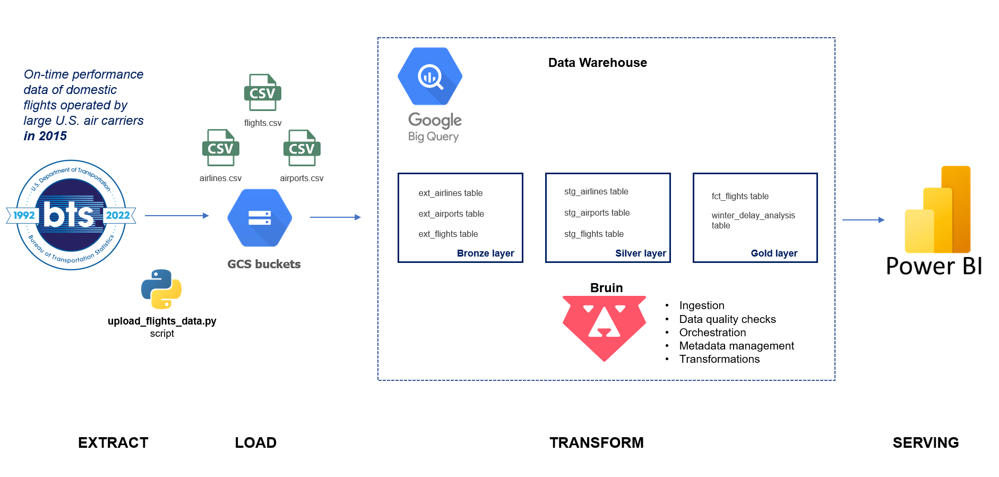
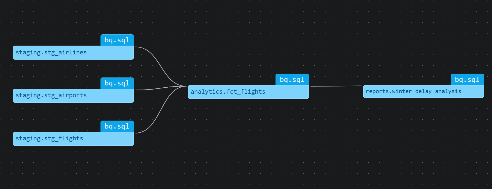

# US Flights Data Engineering Project (2015)
### Medallion Architecture with Python, Kestra, BigQuery, and Bruin

## 📌 Project Overview
This project implements a complete data pipeline to analyze US flight delays and cancellations. Since the official DOT Bureau of Transportation Statistics does not provide a public API, the data is sourced from **Kaggle**. The architecture follows the **Medallion** principle, moving data from raw CSVs to structured analytical reports.



## 🛠️ Tech Stack
* **Ingestion:** Python (Google Cloud Storage Client)
* **Orchestration:** [Kestra](https://kestra.io/)
* **Data Warehouse:** [Google BigQuery](https://cloud.google.com/bigquery)
* **Transformation:** [Bruin](https://github.com/bruin-data/bruin)
* **Storage:** Google Cloud Storage (GCS)
* **Source:** [Kaggle: 2015 Flight Delays and Cancellations](https://www.kaggle.com/datasets/usdot/flight-delays)

---

## 🏗️ Data Pipeline Stages

### 1. Data Acquisition & Ingestion (Bronze Layer)
* **Source:** Manual download of `airlines.csv`, `airports.csv`, and `flights.csv` from Kaggle into `08-course-project/data/flights`.
* **Upload:** The script `upload_flights_data.py` (located in the root) processes these local files and uploads them to a **Google Cloud Storage** bucket.
* **External Access:** BigQuery **External Tables** are defined to reference these CSVs directly from GCS, serving as our **Bronze (Raw)** layer.

### 2. Silver Layer (Staging)
* **Tool:** Bruin
* **Process:** Cleaning, renaming to `snake_case`, and schema enforcement for:
    * `stg_airlines`
    * `stg_airports`
    * `stg_flights` (Optimized with **Day Partitioning** and **Clustering** by `airline_id`).

### 3. Gold Layer (Analytics & Reports)
* **Analytical Table:** `fct_flights` — A comprehensive table joining all staging assets.
* **Features:** * Calculated **Season** field (Winter, Spring, Summer, Autumn).
    * Aggregated delay reasons (Carrier vs. External factors).
* **Reporting:** `winter_delay_analysis` — A specialized data mart identifying high-risk routes during the winter season.



---

## 🚀 Getting Started

### 1. Ingest Raw Data
Place your Kaggle CSV files in `data/flights/` and run the ingestion script:
```bash
python upload_flights_data.py

### 2. Run Transformations
Once the external tables are ready in BigQuery, execute the Bruin pipeline:

bruin run pipeline

### 3. Review the Lineage
To visualize how data flows from Staging to Reports:

bruin lineagelist

## 📂 Project Structure

08-course-project/
├── data/flights/         # Local source CSVs (Kaggle)
├── pipeline/
│   ├── assets/
│   │   ├── staging/      # Silver Layer (SQL)
│   │   ├── analytics/    # Gold Layer (Fact tables)
│   │   └── reports/      # Data Marts (Aggregates)
├── images/               # Visualization & Diagrams
├── upload_flights_data.py # Python script for GCS upload
└── README.md

📊 Sample Insights
Using this architecture, we can visualize how weather-related delays in states like IL (Illinois) peak during Winter compared to more stable regions like FL (Florida).